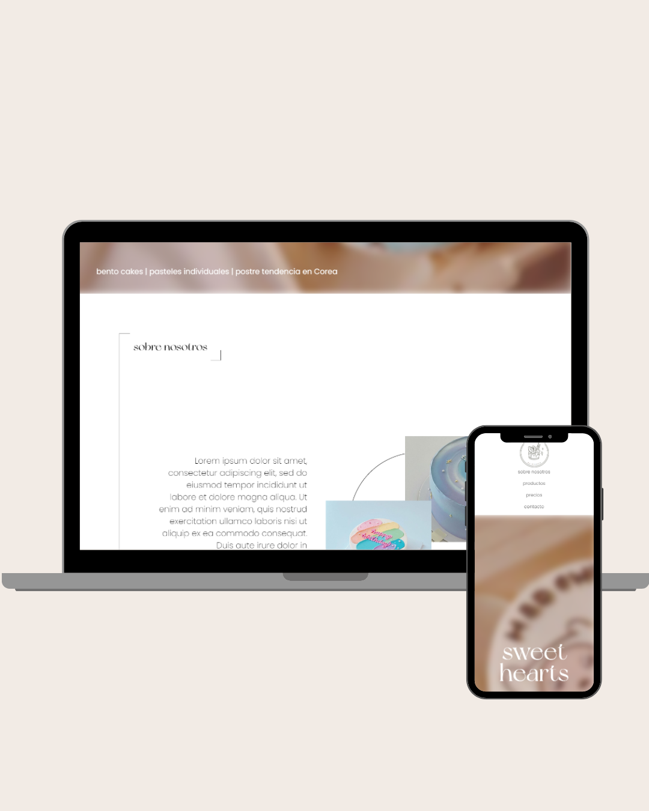

# Sweet Hearts 🍰

Una pequeña web de práctica creada con **React**, **HTML** y **CSS**, inspirada en una pastelería que ofrece postres coreanos. El objetivo fue reforzar el diseño responsivo y la maquetación visual utilizando componentes en React.

🔗 **Demo en vivo**: [sweet-treats-bymicaela.netlify.app](https://sweet-treats-bymicaela.netlify.app/)

## 🖼 Vista previa



## ✨ Características

- Maquetación con HTML y CSS puro
- Componentes reutilizables con React
- Diseño responsive con media queries
- Animación y posicionamiento con `flex` y `grid`
- Layout visual limpio y minimalista

## 📁 Estructura del proyecto

```bash
.
├── public/
│   └── index.html
├── src/
│   ├── assets/          # Imágenes utilizadas
│   ├── components/      # Componentes React como Navbar, SectionTitle, etc.
│   ├── styles/          # Estilos CSS
│   ├── App.jsx
│   └── main.jsx
├── package.json
└── README.md
